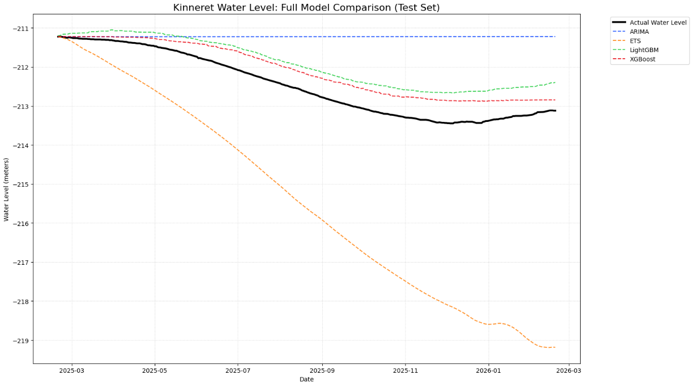
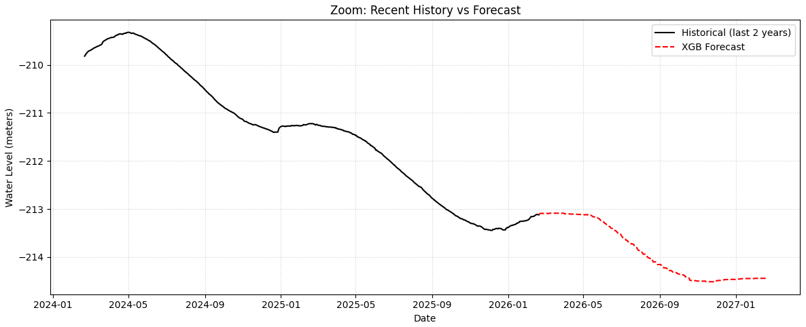

    # 🌊 Kinneret Water Level Forecasting


> An end-to-end machine learning pipeline that forecasts Kinneret water levels using 60+ years of real government data — combining classical time series models with modern gradient boosting and automated hyperparameter optimization.

---

## 📌 Project Highlights

| | |
|---|---|
| 📅 **Data span** | 1966 – Present (21,000+ daily measurements) |
| 🏆 **Best model** | XGBoost (Optuna-tuned, Recursive) |
| 📉 **MAE improvement over baseline** | **72% reduction** vs ARIMA |
| 📉 **RMSE improvement over baseline** | **74% reduction** vs ARIMA |
| 🔁 **Forecasting strategy** | Recursive multi-step (no look-ahead) |
| 🔍 **Hyperparameter tuning** | Optuna — XGBoost & LightGBM |
| ✅ **Validation** | TimeSeriesSplit (8-fold cross-validation) |
| 🌐 **Data source** | Live API — [data.gov.il](https://data.gov.il) |

---

## 📊 Results

### All Models vs Actual — Test Set



> XGBoost and LightGBM closely follow the actual water level trend. ARIMA stays flat, and ETS diverges catastrophically — highlighting why modern gradient boosting outperforms classical statistical methods on this dataset.

---

### XGBoost — 1-Year Future Forecast



> Recursive multi-step forecast extending 1 year beyond the latest available data, plotted against the last 2 years of history. The model picks up the continued downward trend with a smooth, realistic projection.

---

## 🏅 Model Performance

| Model | MAE | RMSE | MAPE | R² |
|---|---|---|---|---|
| **XGBoost** ✅ | **0.3499** | **0.3806** | **0.16%** |
| LightGBM | 0.5571 | 0.5927 | 0.0026% |
| ARIMA | 1.2483 | 1.4852 | 0.59% |
| ETS | 3.5688 | 4.1515 | 1.68% |

> XGBoost achieved a **72% MAE reduction** and **74% RMSE reduction** over the ARIMA baseline.

---

## 🧠 Technical Approach

### 1. 🔁 Recursive Multi-Step Forecasting
Rather than using a direct multi-output approach, this project implements a **recursive forecasting strategy** — each predicted value is fed back into the model as input for the next time step. This mirrors real-world deployment conditions where future ground-truth data is unavailable, and enables genuine long-horizon forecasting (90-day and 1-year projections).

### 2. ✅ Time-Series Cross-Validation (8 Folds)
To ensure evaluation integrity, `TimeSeriesSplit` with 8 folds was applied throughout the entire pipeline — from model selection to Optuna hyperparameter tuning. This strictly preserves temporal order and eliminates any risk of data leakage that standard k-fold cross-validation would introduce on time series data.

### 3. ⚙️ Automated Hyperparameter Optimization (Optuna)
Optuna was used to systematically search the hyperparameter space for both **XGBoost** and **LightGBM**, using recursive RMSE on time-series CV folds as the objective function — ensuring the tuning process reflects real forecasting performance rather than in-sample fit.

### 4. 🛠️ Temporal Feature Engineering
Raw date-indexed data was transformed into a rich feature set:
- **Lag features** — 7, 30, and 365-day lags
- **Rolling statistics** — mean, min, max, std over 7, 30, and 90-day windows
- **Cyclical encodings** — sine/cosine transforms of month and day-of-year to capture seasonality without ordinal bias

### 5. 🔍 Feature Importance Analysis
Post-training feature importance analysis revealed that **short-term rolling statistics (7-day max/mean) dominate predictive signal**, confirming strong short-term momentum in Kinneret water level dynamics.

---

## 📁 Repository Structure

```
kinneret-water-level-forecasting/
│
├── kinneret_water_level.ipynb   # Full pipeline: EDA → features → models → forecasting
├── xgboost_final.pkl            # Trained XGBoost model (full dataset)
├── requirements.txt             # Python dependencies
│
└── images/
    ├── chart_comparison.png     # All models vs actual (test set)
    └── chart_forecast.png       # 1-year future forecast
```

---

## 🚀 How to Run

**1. Clone the repo**
```bash
git clone https://github.com/Shay-Ostrovsky/kinneret-water-level-forecasting.git
cd kinneret-water-level-forecasting
```

**2. Install dependencies**
```bash
pip install -r requirements.txt
```

**3. Open the notebook**
```bash
jupyter notebook kinneret_water_level.ipynb
```

> Data is fetched **live** from the Israeli government open data API — no manual download needed.

**4. Load the saved model**
```python
import joblib
model = joblib.load('xgboost_final.pkl')
```

---

## 🧰 Tech Stack

`Python 3.10` · `XGBoost` · `LightGBM` · `Optuna` · `statsmodels` · `pandas` · `scikit-learn` · `matplotlib` · `seaborn` · `numpy`

---

## 👤 Author

**Shay Ostrovsky**  
[GitHub](https://github.com/Shay-Ostrovsky)

---

*Data sourced from the Israeli Government Open Data Portal — [data.gov.il](https://data.gov.il)*

    
